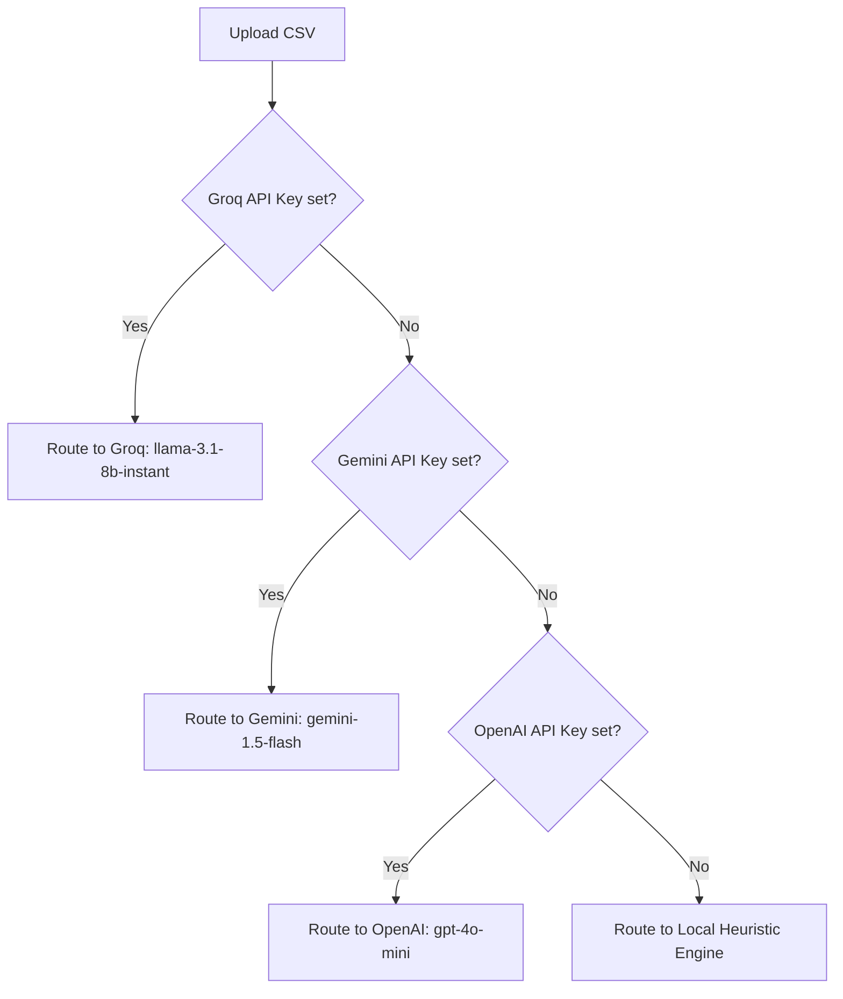

# GrowEasy CRM CSV Importer — End-to-End System Documentation

An exhaustive guide to the architecture, features, database schemas, frontend components, and backend pipeline of the **GrowEasy CRM CSV Importer**.

---

## 1. System Overview

The **GrowEasy CRM CSV Importer** is a professional-grade lead ingestion system. It maps, normalizes, and validates messy contact datasets (such as Facebook Leads exports, Google Ads sheets, or legacy vendor CSVs) into a structured CRM database format.

### Key Capabilities:
* **Hybrid AI + Rule-Engine Extraction**: Combines OpenAI, Google Gemini, and Groq LLMs with a local synonym rule engine as a zero-dependency offline fallback.
* **Strict Validation Pipeline**: Guarantees data cleanliness by skipping rows without primary contacts, formatting dates, mapping enums, and splitting multi-contact inputs.
* **Mockup-Matched Dashboard**: Implements a dark-themed user interface matching the GrowEasy design guidelines (sticky headers, slide-over drawer, relative scaling, and zero-flicker state persistence).

---

## 2. Authentication & Theme Configuration

### 2.1 User Login & Route Protection (`login/page.js`)
* **Mockup-Matched Login Screen**: A clean login card featuring email/password fields styled with focus rings (`focus:ring-[#FA9B83]`) and a primary call-to-action button.
* **Guarded Routing**: The application checks for an active session in a React layout hook.
  - On mount, it checks `localStorage.getItem('groweasy-user')`.
  - If the session token is absent, the router redirects the user to `/login`.
  - If present, it initializes the page view state to authenticated.
* **Dynamic Sidebar Binding**: The profile card in the navigation drawer reads the display name (`user.name`) and organization role (`user.role`) from local storage. Edits to the profile name or role inside the **CRM Settings** page update the sidebar instantly upon saving.

### 2.2 Themes Integration (`ThemeContext.jsx`)
* **Theme Context Provider**: Wraps the entire Next.js application, managing light and dark themes using a custom React Context.
* **Persistent Appearance Caching**: Saves user theme selections to local storage (`groweasy-theme`).
* **Tailwind Variables System**: Inject custom CSS color tokens (`--bg-app`, `--bg-panel`, `--text-primary`, `--border-color`) to maintain consistent styling between themes.

---

## 3. Dashboard Interface & Features

The main viewport layout is bounded to `h-screen overflow-hidden` to prevent outer body scrollbars. Only the leads data table container scrolls, ensuring stats cards and headers remain static at all times.

### 3.1 Real-Time Lead Statistics Grid
The header calculates lead statistics dynamically from the current active list using React `useMemo` hooks:
1. **Total Leads**: Count of successfully imported records.
2. **Conversion Rate**: Percentage of leads carrying the status `SALE_DONE`.
3. **Data Health Score**: Ratio of leads containing BOTH an email address and a mobile phone number (representing database completeness).
4. **Columns Mapped**: Fixed count representing the 15 standard target fields parsed.

### 3.2 Action Toolbar
Positioned directly above the data table:
* **Search Input**: A custom input text field matching the GrowEasy design guidelines, grouping the input and a solid green magnifying glass search button (`bg-[#115e59]`). Filters leads dynamically by email or phone.
* **Refresh/Reset Button**: A circular arrow button (`RefreshCw`) that resets search parameters.
  * **Hover micro-animation**: Rotates `180°` when hovered.
  * **Click animation**: Spins continuously for `750`ms using Tailwind's `animate-spin` class to provide active feedback.
* **JSON Export**: Downloads the current filtered leads table as a JSON array.
* **CSV Export**: Downloads the leads table as a standard CSV file conforming to single-row guidelines.
* **Quick Clear Button**: A red action button (`bg-rose-500/10 hover:bg-rose-500/25 border-rose-500/20 text-rose-500`) that triggers a confirmation modal to clear all imported leads, skipped leads, and stats from browser memory instantly.

### 3.3 Leads Data Table (`Table.jsx`)
* **Sticky Columns & Headers**: Columns stay anchored at the top of the container during vertical scrolls.
* **Responsive Scrolling**: Encompassed inside an `overflow-auto` container to support horizontal and vertical scroll bounds.
* **Qualities & Owners**: Displays lead quality scores and lead owner initials inside clean circle badges (`w-6 h-6 rounded-full bg-slate-500/10 text-xs font-bold`).
* **CRM Status Badges**: Displays status badges colored by state:
  * `GOOD_LEAD_FOLLOW_UP`: Emerald green outline and text (`bg-emerald-500/10 text-emerald-500`).
  * `DID_NOT_CONNECT`: Slate outline and text (`bg-slate-500/10 text-text-secondary`).
  * `BAD_LEAD`: Rose outline and text (`bg-rose-500/10 text-rose-500`).
  * `SALE_DONE`: Indigo outline and text (`bg-indigo-500/10 text-indigo-400`).

---

## 4. Slide-Over Detail Drawer (`Drawer.jsx`)

Clicking the **More >** button on any table row slides out a detailed details panel from the right.

### 4.1 Drawer Features
* **Key Bindings**: Automatically binds an Escape key listener that closes the panel on `ESC`.
* **Body Lock**: Locks scroll events on the parent viewport body while open.
* **Structured Sections**:
  * **Header**: Name, Status, and Data Source badges with custom initials avatars.
  * **Contact Info**: Phone, email, location (City, State, Country).
  * **Employment**: Company and Lead Owner details.
  * **CRM Metadata**: Creation dates, possession timelines, and descriptions.
  * **CRM Notes**: Notes history text box.

### 4.2 Format-Agnostic Regex Contact Promoter
The drawer uses format-agnostic regular expressions to extract secondary contact details from `crm_note` or `description`:
* **Secondary Emails**: Extracts any email addresses matching `/[a-zA-Z0-9._%+-]+@[a-zA-Z0-9.-]+\.[a-zA-Z]{2,}/g` that differ from the primary email.
* **Secondary Phones**: Extracts any digit sequences matching `/(?:\+?\d{1,3}[\s-]?)?\(?\d{3}\)?[\s-]?\d{3}[\s-]?\d{4}|\+?\d{10,15}/g` that clean up to 10-15 digits and differ from the primary phone.
* **Promoted Contact Cards**: Matched secondary contacts are rendered inside the **Contact Information** section as dashed-border cards, each with its own copy button.

---

## 5. CSV Parsing & Import Modal (`Modal.jsx`)

* **Drag-and-Drop Uploader**: Features an interactive dotted-line box for file drops.
* **PapaParse Row Preview**: Loads the CSV locally and displays the first 3 rows in a preview table inside the modal before uploading.
* **Batch Processing Progress Bar**: Displays batch upload progress (e.g. `Processing batch 1 of 5...`) with a fluid CSS transition bar.
* **Tab Selection**: Returns results split into:
  - **Success Tab**: Correctly mapped leads.
  - **Skipped Tab**: Invalid leads lacking both email and phone. Displays the raw row object and skip reason.

---

## 6. AI Extraction & Multi-LLM Routing

The backend maps column headers and row values into standard fields using a cascading routing layer in **[ai.js](file:///c:/Users/satya/OneDrive/Desktop/GrowEasy/crm-importer/backend/services/ai.js)**.



### 6.1 Cascade Order
1. **Groq** (`llama-3.1-8b-instant`): Runs via OpenAI-compatible endpoints. Low-latency structured JSON.
2. **Google Gemini** (`gemini-1.5-flash`): Integrates via `@google/generative-ai` SDK using `application/json` mime configs.
3. **OpenAI** (`gpt-4o-mini`): Configured via the standard `openai` SDK.
4. **Heuristic Engine**: Offline fallback that runs when no API keys are present.

### 6.2 Exponential Backoff Retries
Protects LLM calls against rate limits (HTTP 429) or network drops. If a request fails, it catches the error and retries the request up to 3 times, doubling the delay between each attempt (`1000ms -> 2000ms -> 4000ms`).

### 6.3 Local Heuristic Fallback Engine
When running offline:
* **Synonym Array Matching**: Automatically scans headers against synonym lists for all 15 fields.
* **Name Column Merger**: Merges separate `First Name` and `Last Name` columns.
* **Secondary Contacts Scanning**: Scans all headers for contact synonyms. Any matched columns other than the primary ones are extracted, deduplicated, and appended to `crm_note` as secondary contacts.

---

## 7. Data Normalization & Constraints

The standardization logic in **[transformer.js](file:///c:/Users/satya/OneDrive/Desktop/GrowEasy/crm-importer/backend/services/transformer.js)** enforces the following rules on the extracted records:

1. **CRM Status constraints**: Enforces status values. If a status is missing or invalid, it maps it to one of:
   * `GOOD_LEAD_FOLLOW_UP` (default)
   * `DID_NOT_CONNECT`
   * `BAD_LEAD`
   * `SALE_DONE`
2. **Traffic source constraints**: Enforces campaigns. If a source is invalid or missing, it leaves it blank:
   * `leads_on_demand`, `meridian_tower`, `eden_park`, `varah_swamy`, `sarjapur_plots`
3. **Date parsing**: Standardizes timestamps into `YYYY-MM-DD HH:MM:ss` format for JS compatibility. Defaults to the current system time if invalid or missing.
4. **Contact splits**: Isolates the first contact from multi-valued cells (separated by `,`, `;`, or `/`) for the primary column, sending the rest to notes.
5. **CSV single-row compatibility**: Replaces all raw newlines (`\r\n` or `\n`) in text fields with escaped `\n` characters to prevent row wrapping during CSV exports.

---

## 8. Persistence Architecture

To prevent data loss during browser reloads or page navigation:
* **Synchronous Lazy Initializer Hooks**: The Next.js dashboard checks browser storage during state initialization to load leads, skipped leads, and stats immediately:
  ```javascript
  const [leads, setLeads] = useState(() => {
    if (typeof window !== 'undefined') {
      const saved = localStorage.getItem('groweasy-leads');
      return saved ? JSON.parse(saved) : [];
    }
    return [];
  });
  ```
* **Storage Sync Listeners**: Saves states to `localStorage` (`groweasy-leads`, `groweasy-skipped-leads`, and `groweasy-import-stats`) whenever they change.

---

## 9. Deployment & Multi-Container Setup

The application is containerized for easy deployment.

### Backend Dockerfile (`backend/Dockerfile`)
```dockerfile
FROM node:24-alpine
WORKDIR /app
COPY package*.json ./
RUN npm install --production
COPY . .
EXPOSE 8080
CMD ["node", "server.js"]
```

### Frontend Dockerfile (`frontend/Dockerfile`)
```dockerfile
FROM node:24-alpine
WORKDIR /app
COPY package*.json ./
RUN npm install
COPY . .
RUN npm run build
EXPOSE 3000
CMD ["npm", "start"]
```

### Multi-Container Composer (`docker-compose.yml`)
```yaml
version: '3.8'
services:
  backend:
    build: ./backend
    ports:
      - "8080:8080"
    environment:
      - PORT=8080
      - GEMINI_API_KEY=${GEMINI_API_KEY}
      - GROQ_API_KEY=${GROQ_API_KEY}
      - OPENAI_API_KEY=${OPENAI_API_KEY}
  frontend:
    build: ./frontend
    ports:
      - "3000:3000"
    depends_on:
      - backend
```
