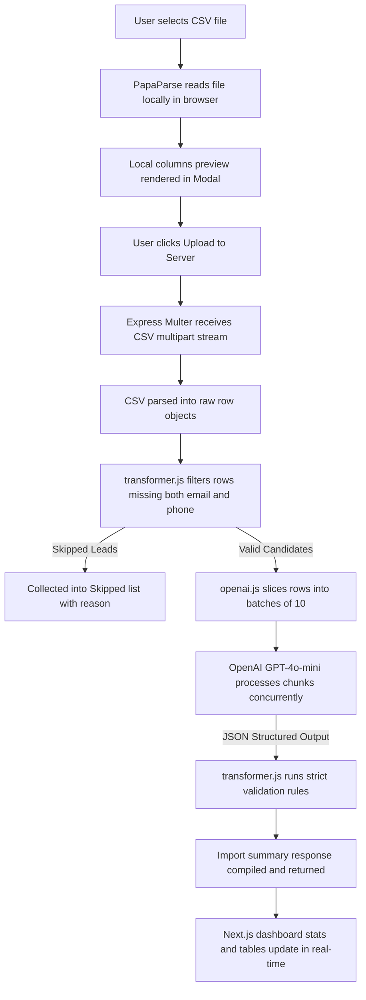

# GrowEasy CRM CSV Importer — End-to-End Documentation

The **GrowEasy CRM CSV Importer** is a production-ready, AI-powered lead onboarding system. It automatically extracts, cleans, validates, and standardizes contact records from messy, unstructured spreadsheets (e.g. Google Ads exports, Facebook Leads, manual vendor files) into a unified CRM-compatible format.

This repository consists of a **Node.js/Express Backend** integrating OpenAI GPT-4o-mini (structured JSON response schema, batch chunking, and exponential retries) and a **Next.js Frontend** (Tailwind CSS v4, dark/light theme context, sticky scrollable tables, and slide-over lead drawers) styled according to the GrowEasy design mockup.

---

## Table of Contents
1. [System Architecture](#system-architecture)
2. [Database Schema & Field Reference](#database-schema--field-reference)
3. [AI Extraction & Prompt Engineering Rules](#ai-extraction--prompt-engineering-rules)
4. [Backend Service Design](#backend-service-design)
5. [Frontend Component Architecture](#frontend-component-architecture)
6. [Docker Setup & Deployment](#docker-setup--deployment)
7. [Installation & Setup](#installation--setup)
8. [Testing & Verification Guides](#testing--verification-guides)

---

## System Architecture

The following diagram illustrates the end-to-end data flow when a user uploads a CSV spreadsheet:



### Key Architectural Layers
1. **Frontend App Router**: Provides responsive layouts, lazy-loaded drawers, and localStorage cache states.
2. **Express REST API**: Performs parsing, validation, chunking, and streaming.
3. **OpenAI JSON-Mode Engine**: Interprets messy header strings, maps columns, and extracts entities dynamically.

---

## Database Schema & Field Reference

The system extracts and standardizes the following 15 fields. If a field is not found or cannot be confidently extracted, it is left blank (`null` or empty string).

| Field Name | Data Type | Description |
| :--- | :--- | :--- |
| `created_at` | DateTime string | ISO 8601 representation of when the lead was generated (JS `new Date()` compatible). |
| `name` | String | Full name of the lead. |
| `email` | String (Valid email) | Primary email address. |
| `country_code` | String (e.g. `+91`) | Telephone international dialing prefix. |
| `mobile_without_country_code` | String | Phone digits excluding country prefix. |
| `company` | String | Company or employer name. |
| `city` | String | Residential or office city. |
| `state` | String | Province, state, or region. |
| `country` | String | Nation name. |
| `lead_owner` | String (Email format) | Email of the salesperson or account manager assigned to this lead. |
| `crm_status` | Enum string | Valid lead status. Must match: `GOOD_LEAD_FOLLOW_UP`, `DID_NOT_CONNECT`, `BAD_LEAD`, `SALE_DONE`. |
| `crm_note` | String | Combined overflow field containing extra phone numbers, secondary emails, and general follow-up remarks. |
| `data_source` | Enum string | Valid traffic campaign. Must match: `leads_on_demand`, `meridian_tower`, `eden_park`, `varah_swamy`, `sarjapur_plots`. |
| `possession_time` | String | Client's property purchase timeframe. |
| `description` | String | General description or secondary comments. |

---

## AI Extraction & Prompt Engineering Rules

The AI backend follows strict extraction criteria to ensure compatibility with CRM database schemas:

1. **CRM Status Constraints**:
   The AI maps status columns (e.g. "Cold", "Called but no answer", "Closed Deal") to one of the following exact enum strings:
   * `GOOD_LEAD_FOLLOW_UP`
   * `DID_NOT_CONNECT`
   * `BAD_LEAD`
   * `SALE_DONE`
   Any other status label defaults to `GOOD_LEAD_FOLLOW_UP`.

2. **Traffic Source Mapping**:
   Campaign or ad sources are mapped to one of the following allowed values:
   * `leads_on_demand`
   * `meridian_tower`
   * `eden_park`
   * `varah_swamy`
   * `sarjapur_plots`
   If no confidence matches exist, it is left blank.

3. **Multi-Email and Multi-Phone Parsing**:
   * If a record contains multiple email addresses, the first valid email is assigned to `email`. Any remaining email addresses are appended to the `crm_note` field.
   * If multiple phone numbers are present, the first phone number is parsed into `country_code` and `mobile_without_country_code`, while subsequent numbers are appended to `crm_note`.

4. **Date Normalization**:
   All timestamps are converted to valid dates (e.g. `YYYY-MM-DD HH:MM:ss` format) so they can be parsed by `new Date(created_at)`. If missing or invalid, the current system time is used.

5. **Single-Row Formatting**:
   Line breaks inside notes or comments are escaped (`\n`) to ensure the exported CSV remains clean.

---

## Backend Service Design

### 1. OpenAI Integration (`backend/services/openai.js`)
* Processes records in parallel batch threads.
* Implements **Exponential Backoff Retry Logic**: If the OpenAI API throws an HTTP 429 (Rate Limit) or HTTP 500 error, it catches the exception and retries the request after a delay that increases exponentially (up to 3 retries).
* Uses `response_format: { type: "json_object" }` to ensure structured JSON output.

### 2. Transformer and Validation Pipeline (`backend/services/transformer.js`)
* Performs initial structural validation.
* **Skip Rule**: If a row contains neither a valid email address nor a mobile phone number, it is skipped. This prevents corrupt rows from consuming AI tokens.
* Normalizes country codes and splits phone digits cleanly.

### 3. CSV Multi-Part Route (`backend/routes/import.js`)
* Handles multipart form data uploads using `multer`.
* Parses input CSV streams into row arrays.
* Distributes validation pipelines and returns the aggregated import statistics.

---

## Frontend Component Architecture

### 1. Main Dashboard View (`frontend/src/app/page.js`)
* Displays active counts, conversion percentages, and data health scores.
* Integrates a search bar that filters leads instantly by email or phone.
* Connects the CSV upload modal and slide-over lead details drawer.
* Anchors all elements to the viewport height (`h-screen overflow-hidden`) to eliminate outer page scrollbars and keep table headers visible.

### 2. Wide Sidebar Navbar (`frontend/src/app/components/Sidebar.jsx`)
* Rebuilt to match the GrowEasy visual mockup:
  * Brand stair-like SVG logo.
  * Test Corp organization selector card.
  * Sidebar navigation links grouped under `Main` and `Control Center`.
  * Dynamic user state binding that updates immediately when the user changes their name in CRM Settings.

### 3. Responsive Table View (`frontend/src/app/components/Table.jsx`)
* Supports **horizontal and vertical scrolling** (`overflow-auto`).
* Implements **sticky headers** that stay anchored at the top of the table.
* Displays status column badges with specific color schemes:
  * `GOOD_LEAD_FOLLOW_UP`: Blue background and text.
  * `SALE_DONE`: Green background and text.
  * `DID_NOT_CONNECT`: Orange background and text.
  * `BAD_LEAD`: Red background and text.

---

## Docker Setup & Deployment

The repository includes a multi-container Docker setup for easy deployment.

### `docker-compose.yml`
```yaml
version: '3.8'

services:
  backend:
    build: ./backend
    ports:
      - "8080:8080"
    environment:
      - PORT=8080
      - OPENAI_API_KEY=${OPENAI_API_KEY}

  frontend:
    build: ./frontend
    ports:
      - "3000:3000"
    depends_on:
      - backend
```

---

## Installation & Setup

### Manual Setup

#### 1. Backend Setup
1. Navigate to the backend directory:
   ```bash
   cd crm-importer/backend
   ```
2. Install dependencies:
   ```bash
   npm install
   ```
3. Create a `.env` file in the backend root:
   ```env
   PORT=8080
   OPENAI_API_KEY=your_openai_api_key_here
   ```
4. Run the server:
   ```bash
   npm run dev
   ```
   The backend will start on **[http://localhost:8080](http://localhost:8080)**.

#### 2. Frontend Setup
1. Navigate to the frontend directory:
   ```bash
   cd crm-importer/frontend
   ```
2. Install dependencies:
   ```bash
   npm install
   ```
3. Start the Next.js development server:
   ```bash
   npm run dev
   ```
   The frontend will start on **[http://localhost:3000](http://localhost:3000)**.

---

## Testing & Verification Guides

To verify the system end-to-end:
1. Open **[http://localhost:3000](http://localhost:3000)**.
2. Click **Import Leads CSV** in the top right.
3. Select a CSV file (e.g. from the provided samples in the documentation).
4. Verify the raw preview table renders correctly inside the modal.
5. Click **Upload File** to process the records.
6. Verify that:
   - Mapped leads appear in the main table with correct formatting.
   - Status badges are colored correctly.
   - The computed statistics at the top update in real-time.
   - Click **More >** on any row to open the inspect drawer and view secondary notes.
